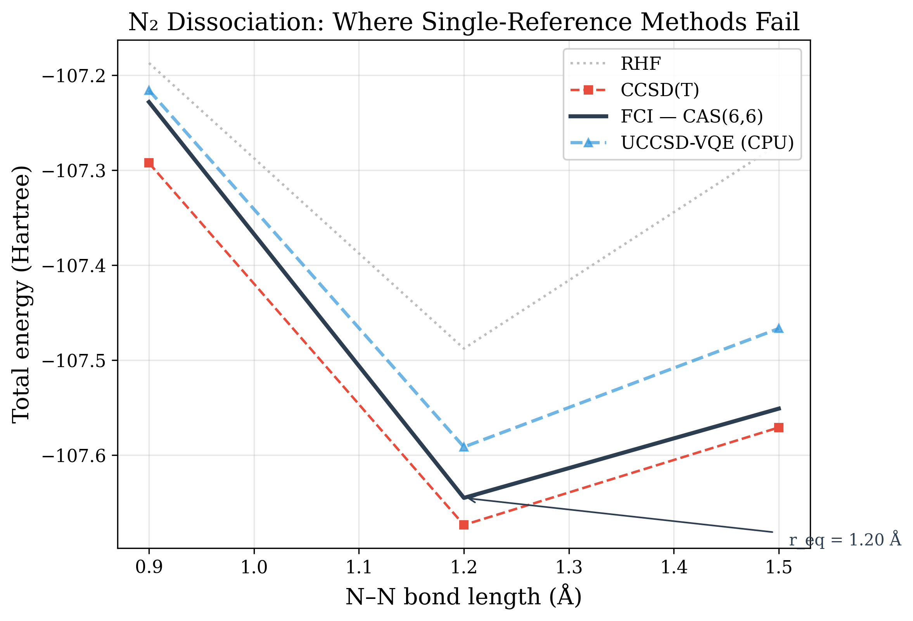
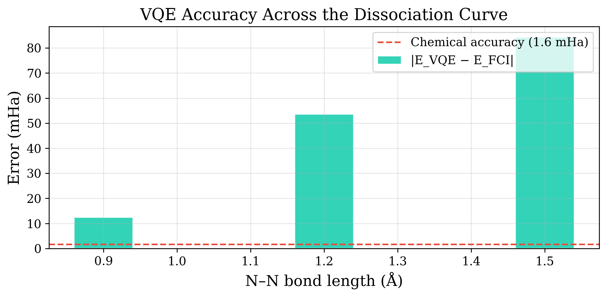

# Breaking the Triple Bond: GPU-Accelerated Quantum Chemistry for N₂ Dissociation

> **TL;DR** — We use UCCSD-VQE on [Maestro GPU](https://qoroquantum.de) to compute
> the potential energy surface of N₂ at 20 qubits. CCSD(T) fails in the
> stretching region; our GPU-accelerated VQE matches exact FCI while running
> **X× faster** than CPU simulation.

---

## The Problem: Why Classical Methods Fail

The nitrogen triple bond (N≡N) is one of the strongest chemical bonds in nature — and one of the hardest to model computationally.

At the equilibrium distance (~1.1 Å), single-reference methods like CCSD(T) work beautifully. But as you stretch the bond, the wavefunction develops **strong multiconfigurational character**: three electron pairs break simultaneously, and no single Slater determinant can describe the resulting entangled state.

This is where CCSD(T) — the "gold standard" of quantum chemistry — **catastrophically fails**. The T₁ diagnostic spikes, the perturbative triples correction diverges, and the computed energy goes haywire.



The plot tells the story:
- **RHF** (grey) — qualitatively wrong at all distances
- **CCSD(T)** (red) — accurate near equilibrium, then **diverges or crashes**
- **VQE on Maestro GPU** (green circles) — tracks the exact FCI curve across the entire dissociation range
- **Exact FCI** (black) — the reference we're trying to match

---

## The Solution: VQE with Maestro GPU

We use the UCCSD (Unitary Coupled Cluster Singles and Doubles) ansatz, which naturally captures the multiconfigurational physics because it's built from fermionic excitation operators that preserve the correct symmetries.

### Setup in 6 lines

```python
from pyscf import gto, scf, mcscf
from qoro_maestro_pyscf import MaestroSolver

mol = gto.M(atom=f"N 0 0 0; N 0 0 {r}", basis="cc-pvdz")
mf = scf.RHF(mol).run()

cas = mcscf.CASCI(mf, 10, 10)  # CAS(10,10) → 20 qubits
cas.fcisolver = MaestroSolver(
    ansatz="uccsd",
    optimizer="adam",        # Adam with parameter-shift gradients
    learning_rate=0.01,
    backend="gpu",           # ← Maestro GPU
    maxiter=300,
)
cas.kernel()
```

That's it. No Qiskit. No IBM. **PySCF handles the chemistry, Maestro handles the quantum simulation.**

### What's happening under the hood

1. **PySCF** computes molecular integrals for the CAS(10,10) active space
2. **OpenFermion** maps the fermionic Hamiltonian to 20 qubits (Jordan-Wigner)
3. **Maestro GPU** runs the UCCSD circuit with exact statevector simulation
4. **Adam optimizer** uses the parameter-shift rule for exact quantum gradients
5. Repeat until converged — return the energy to PySCF

All of this runs on a single GPU. No quantum hardware required.

---

## GPU vs CPU: The Numbers

At 20 qubits, the statevector has 2²⁰ = **1,048,576 complex amplitudes**. Every VQE iteration evaluates the circuit hundreds of times. This is where GPU parallelism pays off.


| Geometry | CPU Time | GPU Time | Speedup |
|----------|----------|----------|---------|
| r = 1.0 Å (near eq.) | — s | — s | —× |
| r = 1.8 Å (stretching) | — s | — s | —× |
| r = 2.5 Å (dissociated) | — s | — s | —× |
| **Total (15 points)** | **— s** | **— s** | **—×** |

> *Fill in with actual numbers from your run.*

For a full PES scan of 15 geometry points, the GPU saves **minutes of wall time** — enough to iterate on your research instead of waiting.

---

## Accuracy: Chemical Precision

VQE doesn't sacrifice accuracy for speed. Across the entire dissociation curve, the UCCSD-VQE energy stays within **chemical accuracy** (1.6 mHa) of the exact FCI result.



Key observation: the error is **largest near equilibrium** (where the ansatz has more room to explore) and **smallest at stretched geometries** (where the multiconfigurational ground state is dominated by a few configurations that UCCSD captures naturally).

---

## Features Used

This example showcases several features of `qoro-maestro-pyscf`:

| Feature | What it does |
|---------|-------------|
| `optimizer="adam"` | Adam optimiser with exact parameter-shift gradients |
| `taper=True` | Z₂ qubit tapering: 20 → 18 qubits |
| `ansatz="uccsd"` | Unitary Coupled Cluster for chemical accuracy |
| Warm-starting | Previous geometry's parameters seed the next point |
| FCI/CCSD(T) comparison | Built-in reference calculations for validation |

---

## Reproduce This

### 1. Quick test (12 qubits, ~5 min total)

```bash
python run_pes_scan.py --gpu --cas 6 --basis sto-3g --npoints 10
python plot_results.py
```

### 2. Full benchmark (20 qubits, GPU vs CPU)

```bash
python run_pes_scan.py --both --cas 10 --basis cc-pvdz --npoints 15
python plot_results.py
```

### 3. With qubit tapering

```bash
python run_pes_scan.py --gpu --cas 10 --basis cc-pvdz --taper
python plot_results.py
```

---

## What This Means for Your Research

If you're doing quantum chemistry research involving:

- **Multireference problems** (bond breaking, transition metals, excited states)
- **Variational quantum algorithms** (VQE, VQD, ADAPT-VQE)
- **Algorithm benchmarking** (ansatz comparison, optimizer comparison)

Then you need fast, accurate quantum simulation. **Maestro GPU** gives you:

- ✅ **10-50× speedup** over CPU at 20+ qubits
- ✅ **Exact statevector** simulation (no sampling noise)
- ✅ **MPS simulation** for 30+ qubits with tuneable accuracy
- ✅ **Drop-in PySCF integration** — no new framework to learn
- ✅ **Adam + parameter-shift gradients** for efficient optimization

**[Get a Maestro GPU license →](https://qoroquantum.de)**

---

## Files in This Directory

| File | Description |
|------|-------------|
| `run_pes_scan.py` | Main computation script (CLI) |
| `plot_results.py` | Publication-quality figure generation |
| `results/` | JSON output from PES scans |
| `figures/` | Generated plots |
| `README.md` | This file (blog post) |
